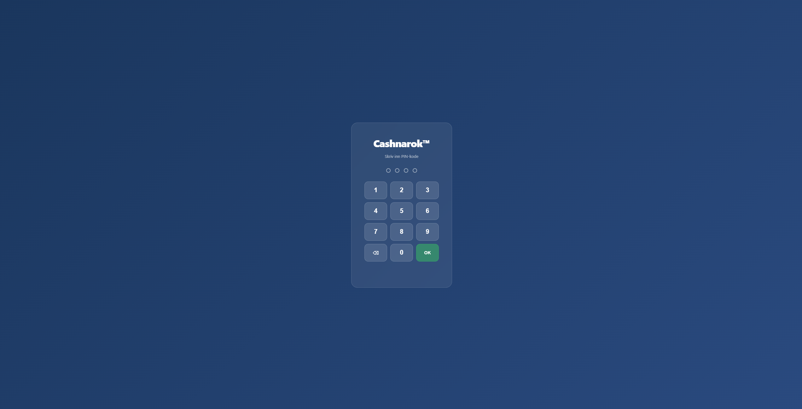
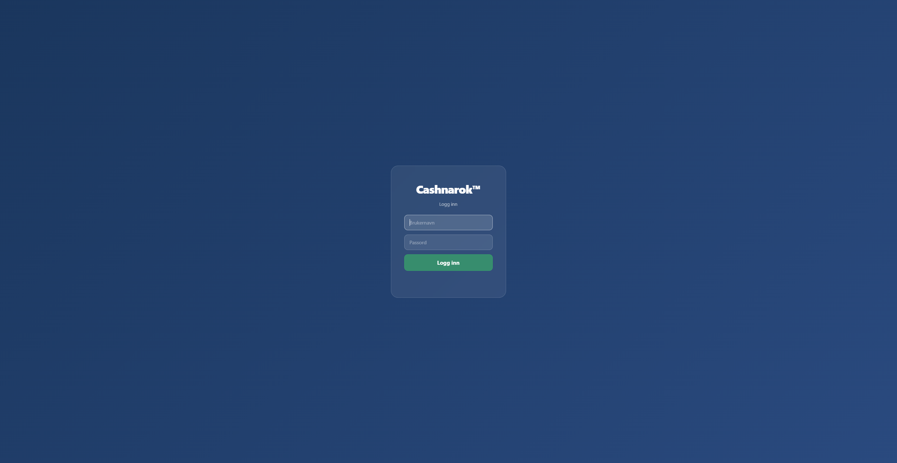
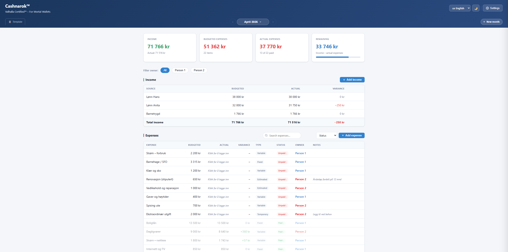
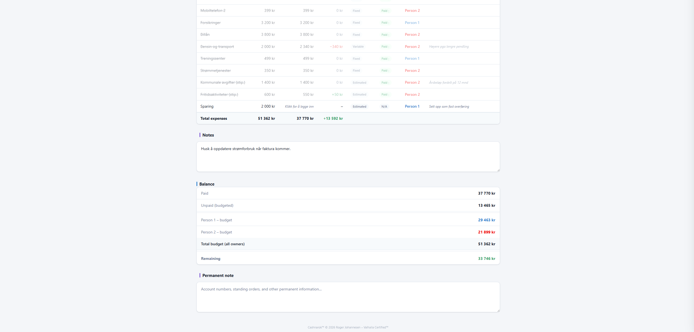
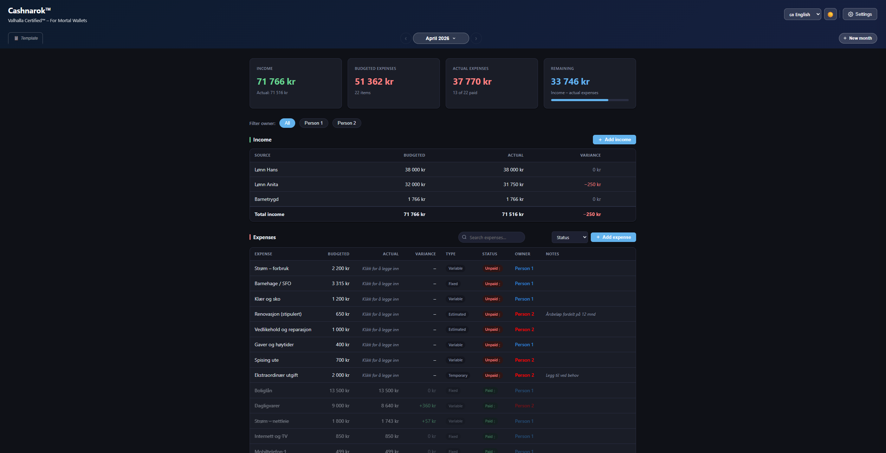
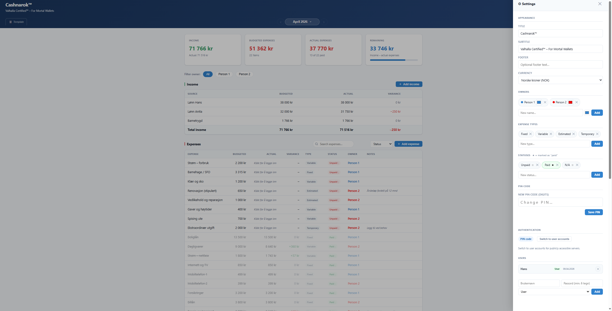

# cashnarok
Budget tracker from the halls of Valhalla. Track income &amp; expenses, juggle multiple users, log in via PIN or account. Runs LAMP (Debian 12 / Proxmox). Norwegian, English &amp; German UI. No cloud, no subscriptions. Highly customisable.
*"Valhalla Certified™ – For Mortal Wallets"*

A lightweight, privacy-first household budget web application built for self-hosting. Track income and expenses across months, manage multiple budget owners, and keep full control of your financial data on your own server.

No subscriptions. No cloud. No tracking. Odin approved.

---

Simple pincode access level for internal hosting.


Advanced access level for public hosting.


Default layout 1/2.


Default layout 2/2.


Dark mode activated.


Internal settings and customisation.

## Features

### Budget management
- **Monthly sheets** — each month is an independent budget sheet
- **Reusable template (MAL)** — define your standard budget once, create new months from it in one click
- **Apply template to current month** — push template changes to an existing month without losing recorded actuals
- **Income & expenses** — budgeted vs. actual amounts with automatic variance column
- **One-click status toggle** — mark expenses as paid / unpaid / not applicable
- **Expense types** — categorise as Fixed, Variable, Estimated, or Temporary
- **Owner assignment** — assign expenses to individual household members and filter by owner
- **Notes** — per-month notes and a permanent notes field for account numbers, standing orders, etc.

### Interface
- **Three languages** — Norwegian, English, German; switch instantly from the header
- **Language-aware labels** — expense types and statuses automatically translate when you switch language
- **Dark mode** — full dark/light theme, saved per device
- **Currency selector** — NOK, SEK, DKK, ISK, EUR, USD, GBP, CHF with correct symbol placement
- **Summary cards** — income, budgeted expenses, actual expenses, and remaining balance at a glance
- **Responsive** — works on desktop and mobile

### Authentication
- **PIN mode** — simple shared PIN for household use on a private network or VPN
- **User accounts mode** — full username + password login for publicly accessible servers; manage users directly from the settings panel
- **Role-based access** — Admin users can manage other accounts; regular users can only change their own password
- Switch between modes at any time from Settings without losing data

### Deployment
- **Standalone mode** — `budsjett.html` runs entirely in the browser with no server (data is in-memory only)
- **Server mode** — `server/` package for persistent, multi-device access on a LAMP stack

---

## Repository structure

```
.
├── budsjett.html          # Standalone single-file app (no server required)
├── README.md
├── .gitignore
└── server/
    ├── index.html         # Main application (server version)
    ├── api.php            # REST API — all data operations
    ├── db.php             # Database connection (⚠ generated by install.sh, never committed)
    ├── install.php        # First-run web installer (disables itself after use)
    ├── install.sh         # Automated setup script for Debian 12 LXC
    ├── .htaccess          # Apache: SPA routing + security rules
    └── howto.html         # Full step-by-step installation guide
```

---

## Quick start — standalone (no server)

Open `budsjett.html` directly in any browser. No installation required. Data lives only in memory and is lost on refresh — useful for testing or a one-off session.

---

## Server installation (Debian 12 / Proxmox LXC)

A detailed guide with screenshots and troubleshooting is in `server/howto.html`. Short version below.

### 1. Create a Debian 12 LXC in Proxmox

| Setting  | Recommended value            |
|----------|------------------------------|
| Template | `debian-12-standard`         |
| Disk     | 8 GB                         |
| RAM      | 256 MB                       |
| Network  | DHCP, bridge `vmbr0`         |

### 2. Copy files to the container

```powershell
# From Windows PowerShell, inside the server/ folder
scp index.html api.php db.php install.php .htaccess install.sh howto.html `
    root@<CONTAINER-IP>:/root/budsjett/
```

> **Important:** Always SCP before running `install.sh`. The script copies from `/root/budsjett/` to `/var/www/html/` — if you skip the SCP, the server gets stale files.

### 3. Run the installer

```bash
cd /root/budsjett
chmod +x install.sh
bash install.sh
```

This will automatically:
- Install Apache2, PHP 8, and MariaDB
- Create the `budsjett` database with a randomly generated 24-character password
- Write `db.php` with the real credentials (excluded from git)
- Copy all app files to `/var/www/html/`
- Configure Apache with `AllowOverride All` and `mod_rewrite`
- Set correct file ownership for `www-data`

### 4. Run the web installer

```
http://<CONTAINER-IP>/install.php
```

Fill in your household title, owner names, colour tags, and a PIN code. The installer seeds a demo month with realistic data and disables itself permanently on success.

### 5. Open the app

```
http://<CONTAINER-IP>/
```

---

## Setting up user accounts (for public servers)

If you plan to expose the app to the internet rather than using a VPN, switch from PIN mode to user account authentication:

1. Log in with your PIN
2. Open **Settings** (⚙ in the header)
3. Scroll to **Authentication → Users**
4. Add at least one user with the **Admin** role
5. Click **Switch to user accounts** — confirm the prompt
6. Log out — the login screen now shows a username and password form

User management (add, delete, reset password) is available in Settings for Admin users. Regular users can only change their own password.

> **Recommendation:** If exposing to the internet, also enable HTTPS using Let's Encrypt / Certbot.
> ```bash
> apt install certbot python3-certbot-apache -y
> certbot --apache
> ```

---

## Remote access via Tailscale VPN

The simplest way to access the app securely from outside your home without opening firewall ports or setting up HTTPS:

```bash
curl -fsSL https://tailscale.com/install.sh | sh
tailscale up
tailscale ip -4   # note this IP for bookmarking
```

Install Tailscale on your phone or laptop, sign in with the same account, and the app is reachable at `http://<TAILSCALE-IP>/` from anywhere — encrypted over WireGuard, no port forwarding required.

---

## Tech stack

| Layer    | Technology                              |
|----------|-----------------------------------------|
| Frontend | Vanilla HTML / CSS / JavaScript (no framework) |
| Backend  | PHP 8 — single `api.php` REST endpoint  |
| Database | MariaDB via PDO                         |
| Server   | Apache2 with `mod_rewrite`              |
| Auth     | PHP sessions — PIN mode or user accounts (bcrypt) |
| Hosting  | Proxmox LXC — Debian 12                |

---

## Database schema

```sql
settings  (key VARCHAR(64) PK, value TEXT)
sheets    (key VARCHAR(16) PK, notes TEXT)
income    (id, sheet_key → sheets, name, budgeted, actual, sort_order)
expenses  (id, sheet_key → sheets, name, budgeted, actual, type, status, owner, note, sort_order)
users     (id, username UNIQUE, password_hash, role ENUM('admin','user'), created_at)
```

The `users` table is created automatically on first use — no manual migration needed when upgrading from PIN-only mode.

All child rows cascade-delete when a sheet is removed.

---

## After a fresh `git clone` — re-deploying to an existing server

If you pull updates and want to push them to a running server:

```powershell
# 1. SCP updated files
scp server/index.html server/api.php root@<IP>:/root/budsjett/

# 2. Copy to web root and fix ownership
ssh root@<IP> "cp /root/budsjett/index.html /root/budsjett/api.php /var/www/html/ && chown www-data:www-data /var/www/html/index.html /var/www/html/api.php"
```

Or create `/root/deploy.sh` on the server for convenience:

```bash
#!/bin/bash
cp /root/budsjett/*.html /root/budsjett/*.php /var/www/html/
chown www-data:www-data /var/www/html/*.html /var/www/html/*.php
echo "Deployed."
```

---

## Security notes

| Topic | Detail |
|-------|--------|
| `db.php` | Excluded from git — contains the database password, generated locally by `install.sh` |
| `.htaccess` | Blocks direct HTTP access to `db.php` and `install.php.done` |
| PIN storage | Stored as plain text — acceptable for private network / VPN use only |
| Password storage | bcrypt via PHP `password_hash()` — safe for public-facing use |
| Recommended setup | Private home network or Tailscale VPN for PIN mode; HTTPS + user accounts for public servers |

---

## Known issues

| Symptom | Cause | Fix |
|---------|-------|-----|
| `install.php` returns HTTP 500 | PHP parse error (old file) | Use the latest `install.php` from this repo |
| Tables not created after install | Multi-statement `PDO::exec()` limitation | Use the latest `install.php` — each `CREATE TABLE` is now a separate call |
| PIN never accepted | Auto-submit bug in old `index.html` | Use the latest `index.html` and do a hard refresh (`Ctrl+Shift+R`) |
| Forbidden (403) after deploy | File owned by `root` instead of `www-data` | Run `chown www-data:www-data /var/www/html/index.html` |

Full diagnostics and shell commands are in `server/howto.html`.

---

## License

Personal use.  
© 2026 Roger Johannesen — Valhalla Certified™
